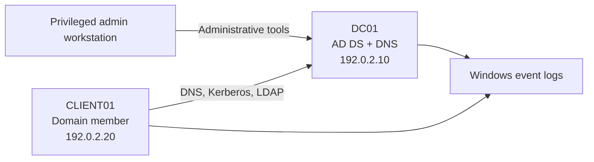

# Active Directory Home Lab

**Status:** Portfolio case studies complete  
**Project source:** Coursework-derived, independently rewritten and documented  
**Domain:** Identity and access management / Windows administration

## Overview

This project demonstrates how I designed and administered a small Windows domain in an isolated lab. It converts skills first practiced during coursework into an original, sanitized case study.

## Objectives

- Deploy a domain controller and configure AD DS and DNS
- Design organizational units and role-based groups
- Provision test users without exposing real personal information
- Join a Windows client to the domain
- Apply and validate Group Policy
- Review authentication and administrative events

## Documented lab environment

| Component | Purpose |
|---|---|
| Windows Server | Domain controller, AD DS, and integrated DNS |
| Windows client | Domain-joined endpoint used for authentication and policy checks |
| Type-2 hypervisor | Isolated virtual network for the server and client |
| PowerShell | Administration and validation |

## Architecture

All names and addresses are fictional documentation values.

## Case studies

| Case study | Skill | Status |
|---|---|---|
| [Domain deployment](docs/01-domain-deployment.md) | AD DS, DNS, domain join, GPO validation | Complete analytical case study |
| [Multi-site Active Directory security design](docs/multisite-active-directory-security-design.md) | Topology, OUs, GPO, resilience | Complete design case study |

## Evidence represented

- Original architecture diagrams using documentation-safe values
- A fictional OU, group, and delegation model
- Exact validation commands and expected results
- Troubleshooting reasoning for DNS, domain join, and Group Policy
- Event IDs relevant to authentication and account administration

## Skills demonstrated

AD DS, DNS, Group Policy, identity lifecycle, Windows event logs, PowerShell, troubleshooting, technical documentation.

## Safety and attribution

No course prompts, answer keys, school files, real identities, credentials, product keys, or private network details are included. The case studies document work performed during coursework without republishing the course materials. Screenshots are intentionally omitted because the available captures contain lab-provider or school-specific details.
# Active Directory Home Lab

**Status:** Coursework analyzed; sanitized rebuild in progress  
**Project source:** Coursework-derived, independently rewritten and documented  
**Domain:** Identity and access management / Windows administration

## Overview

This project demonstrates how I designed and administered a small Windows domain in an isolated lab. It converts skills first practiced during coursework into an original, sanitized case study.

## Objectives

- Deploy a domain controller and configure AD DS and DNS
- Design organizational units and role-based groups
- Provision test users without exposing real personal information
- Join a Windows client to the domain
- Apply and validate Group Policy
- Review authentication and administrative events

## Lab environment

| Component | Purpose |
|---|---|
| Windows Server [version] | Domain controller, AD DS, DNS |
| Windows [client version] | Domain-joined endpoint |
| [VirtualBox/VMware/Hyper-V] | Isolated virtualization |
| PowerShell | Administration and validation |

## Architecture

Add an original network diagram to `images/topology.png` using example-only values.

## Case studies

| Case study | Skill | Status |
|---|---|---|
| [Domain deployment](docs/01-domain-deployment.md) | AD DS and DNS | Planned rebuild |
| [Multi-site Active Directory security design](docs/multisite-active-directory-security-design.md) | Topology, OUs, GPO, resilience | Coursework case study complete |

## Evidence checklist

- Sanitized topology diagram
- AD Users and Computers view with fictional accounts
- Domain join verification
- `gpresult` output with sensitive values removed
- Relevant Event Viewer entries with an explanation

## Skills demonstrated

AD DS, DNS, Group Policy, identity lifecycle, Windows event logs, PowerShell, troubleshooting, technical documentation.

## Safety and attribution

No course prompts, answer keys, school files, real identities, credentials, product keys, or private network details are included. Screenshots and explanations must be original.
