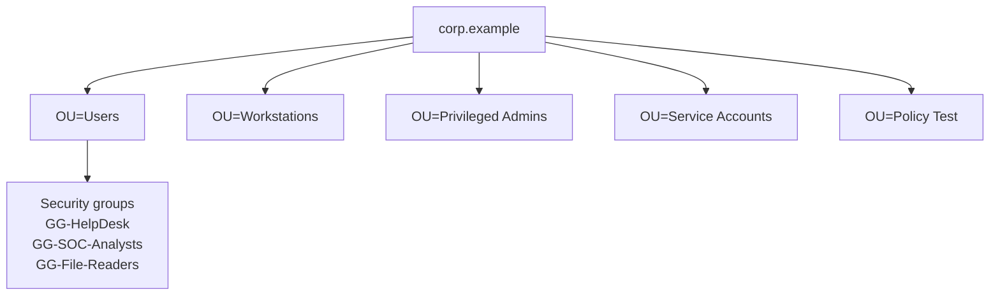

# Case Study: Domain Deployment

**Source:** Coursework-derived skill, independently reproduced  
**Status:** Complete analytical case study
**Environment:** Fictionalized for safe publication

## Scenario

A small professional-services company needs centralized authentication for a Windows workstation fleet. Local accounts make onboarding, access reviews, and password enforcement inconsistent. The proposed lab domain centralizes identity, name resolution, and endpoint policy while preserving an isolated test environment.

## Objective

Deploy a single-forest, single-domain Active Directory environment and demonstrate that:

- the domain controller provides AD DS-integrated DNS;
- a Windows endpoint can locate and join the domain;
- fictional users can authenticate;
- group-based access and OU-scoped policy apply as designed; and
- administrative and authentication events are available for review.

## Environment

| System | Example identity | Address | Function |
|---|---|---|---|
| Domain controller | `DC01.corp.example` | `192.0.2.10` | AD DS, DNS, Group Policy |
| Windows client | `CLIENT01.corp.example` | `192.0.2.20` | Domain member and validation host |
| Virtual network | `LAB-NET` | `192.0.2.0/24` | Host-only, isolated network |

`corp.example` and `192.0.2.0/24` are documentation-only values.

## Implementation summary

1. Assigned the server a stable address and configured the client to use the domain controller as its DNS resolver.
2. Installed Active Directory Domain Services and created a new forest.
3. Verified creation of the AD-integrated forward lookup zone and service records used for domain-controller discovery.
4. Created separate OUs for workstations, standard users, privileged administrators, service accounts, and policy testing.
5. Created role groups and assigned access through group membership rather than direct user permissions.
6. Joined the Windows client to the domain and moved it into the managed-workstation OU.
7. Linked a workstation baseline GPO to the test OU before wider application.

The OU design follows administrative and policy boundaries instead of copying the company reporting chart. This makes delegation and troubleshooting more predictable.

## Validation

| Control | Validation method | Expected result |
|---|---|---|
| DNS client configuration | `ipconfig /all` | Domain controller is the preferred DNS server |
| Domain-controller discovery | `nltest /dsgetdc:corp.example` | `DC01` is returned with directory-service flags |
| DNS records | `Resolve-DnsName _ldap._tcp.dc._msdcs.corp.example` | LDAP service record resolves to the domain controller |
| Secure channel | `Test-ComputerSecureChannel -Verbose` | Client secure channel reports healthy |
| Directory health | `dcdiag /test:dns` | DNS tests complete without critical errors |
| Policy application | `gpresult /r` | The workstation baseline appears under applied GPOs |
| Authentication logging | Event Viewer, Security log | Successful and failed test logons create reviewable events |

Useful Windows Security events include `4624` for successful logon, `4625` for failed logon, `4720` for user creation, `4728` or `4732` for security-group membership changes, and `4740` for account lockout. Event availability depends on the configured audit policy.

## Challenges and resolution

The most important troubleshooting lesson was that a domain join can fail even when basic IP connectivity works. Active Directory depends on DNS service records, not only reachability.

The diagnostic sequence was:

1. confirm the client had the correct address and gateway;
2. confirm its DNS server pointed to `DC01`, not a public resolver;
3. resolve the domain name and LDAP service record;
4. verify time synchronization because Kerberos is time-sensitive; and
5. retry the join using the fully qualified domain name.

This sequence separates network, naming, time, and credential problems instead of repeatedly attempting the same join.

## Security considerations

- Use separate standard and privileged identities for administrators.
- Delegate routine tasks to the smallest applicable OU.
- Place service accounts in a dedicated OU and deny interactive sign-in where appropriate.
- Apply GPO changes to a test OU before production-like scopes.
- Enable audit categories needed for logon, account management, directory-service changes, and policy changes.
- Protect and test system-state backups; replication is not a backup.
- Avoid exposing LDAP, SMB, RDP, or administrative interfaces outside the isolated lab.

## Lessons learned

This work strengthened my ability to explain the relationship between AD DS, DNS, Kerberos, OUs, groups, Group Policy, and Windows event logs. It also reinforced a repeatable troubleshooting method: verify dependencies first, collect evidence, change one variable, and then validate the result.
